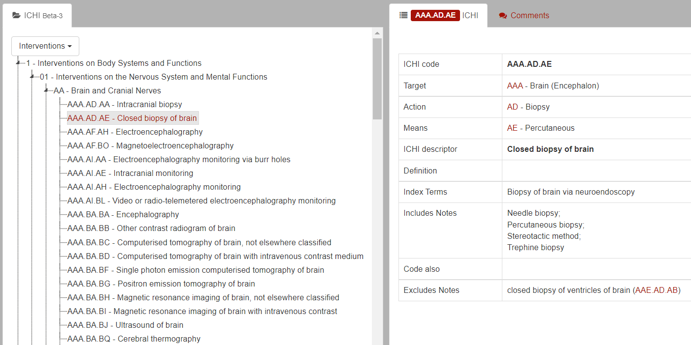

# Web Scraper
- Scrape the browser for the [ICHI Beta-3](https://mitel.dimi.uniud.it/ichi/ "International Classification of Health Interventions")

  

  
## 개요
- 한국건강행위분류(KCHI) 개발 6차 연구 자문역  
- 동적 웹페이지 트리 형태의 데이터를 수집, 엑셀파일로 저장
- 데이터: [ICHI Beta-3](https://mitel.dimi.uniud.it/ichi/ "International Classification of Health Interventions")의 Right Content
    - 5개 항목 Interventions, Target, Action, Means, ExtensionCodes
    - 항목별로 7천 ~ 1만여개의 Record를 추출
  
- 포맷은 교수의 요구사항대로 제작

## 자료
- [코드](ICHICrawler/ICHICrawler.py)
- [예시 파일 xlsx](/ICHICrawler/ICHI_Beta_3.xlsx)
    - Dropdown Menu에 Interventions, ExtentionCodes 자료 스크랩
- [Error Note](ErrorNote.md)
      
## 개발 노트
- 220615
    - Interventions, ExtentionCodes 스크랩 정상 작동
    - Target, Action, Means에서 *UnexpectedAlertPresentException*

## Selenium
- `By.CSS_SELECTOR`가 `By.XPATH`보다 처리 속도가 빠르다
- 웹 엘리먼트에 접근할 때마다 시간소요가 큼
- `Implicitly_wait()`가 완벽하진 않다